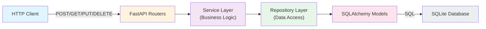

# RESTful CRUD API with FastAPI + SQLite

A production-structured REST API demonstrating HTTP API design principles, ORM usage, and clean layered architecture.

## Quick Start

### Run the API locally
```bash
uvicorn src.app.main:app --reload
```

Visit [http://localhost:8000/docs](http://localhost:8000/docs) to explore the API with Swagger UI.

### Run tests
```bash
pytest
```

Test coverage: **97%** (31 tests, all passing)

## Project Overview

This API demonstrates:
-  RESTful design with proper HTTP verbs and status codes
-  SQLAlchemy ORM for database operations
-  Pydantic schema validation
-  Layered architecture (routers → services → repositories)
-  Comprehensive error handling
-  Auto-generated Swagger/OpenAPI documentation
- Full integration test coverage

## Architecture



### Layer Responsibilities

| Layer | Responsibility |
| :-- | :-- |
| **Routers** | HTTP request handling, response formatting, dependency injection |
| **Services** | Business logic, error handling, validation decisions |
| **Repositories** | Database queries, CRUD operations via SQLAlchemy |
| **Models** | ORM entity definitions, table schema |
| **Schemas** | Pydantic validation, request/response shape |

## API Endpoints

| Method | Path | Request Body | Response | Status | Description |
| :-- | :-- | :-- | :-- | :-- | :-- |
| `GET` | `/health` | — | `{"status": "ok"}` | 200 | Health check |
| `GET` | `/projects` | — | `ProjectResponse[]` | 200 | List all projects, optionally filter by `?status=planned` |
| `GET` | `/projects/{id}` | — | `ProjectResponse` | 200, 404 | Retrieve a single project |
| `POST` | `/projects` | `ProjectCreate` | `ProjectResponse` | 201, 422 | Create a new project |
| `PUT` | `/projects/{id}` | `ProjectUpdate` | `ProjectResponse` | 200, 404, 422 | Update a project (partial updates supported) |
| `DELETE` | `/projects/{id}` | — | — | 204, 404 | Delete a project |

## Pydantic Schemas

### ProjectCreate
Request body for `POST /projects`:
```python
{
  "name": "string (1-120 chars, required)",
  "description": "string (0-2000 chars, optional)",
  "status": "planned | pending | complete (default: planned)"
}
```

### ProjectUpdate
Request body for `PUT /projects/{id}` (all fields optional):
```python
{
  "name": "string (1-120 chars, optional)",
  "description": "string (0-2000 chars, optional)",
  "status": "planned | pending | complete (optional)"
}
```

### ProjectResponse
Response body for all endpoints (includes timestamps):
```python
{
  "id": "integer",
  "name": "string",
  "description": "string | null",
  "status": "planned | pending | complete",
  "created_at": "ISO 8601 datetime",
  "updated_at": "ISO 8601 datetime"
}
```

## Example Requests

### Create a project
```bash
curl -X POST "http://localhost:8000/projects" \
  -H "Content-Type: application/json" \
  -d '{
    "name": "Build ML Pipeline",
    "description": "Implement data preprocessing and feature engineering",
    "status": "pending"
  }'
```

### List all projects
```bash
curl "http://localhost:8000/projects"
```

### Filter projects by status
```bash
curl "http://localhost:8000/projects?status=complete"
```

### Update a project
```bash
curl -X PUT "http://localhost:8000/projects/1" \
  -H "Content-Type: application/json" \
  -d '{"status": "complete"}'
```

### Delete a project
```bash
curl -X DELETE "http://localhost:8000/projects/1"
```

## Testing

All endpoints are covered by integration tests:

**CRUD Tests (15 tests)**
- Project creation (minimal, full, custom status)
- Retrieval (empty list, all projects, by ID, not found)
- Status filtering
- Updates (partial, full, non-existent)
- Deletion
- Health check

**Validation Tests (16 tests)**
- Name validation (required, empty, length)
- Description validation (optional, length)
- Status validation (defaults, valid values, invalid values)
- Update validation
- Invalid JSON handling

Run tests with coverage:
```bash
pytest tests/ -v --cov=src/app --cov-report=term-missing
```

## Project Structure

```
fastapi-project-api/
├── README.md                           # This file
├── .gitignore                          # Git ignore rules
├── requirements.txt                    # Python dependencies
├── pyproject.toml                      # Project metadata
├── src/
│   └── app/
│       ├── __init__.py
│       ├── main.py                     # FastAPI app, lifespan, routes
│       ├── database.py                 # SQLAlchemy setup, session factory
│       ├── models.py                   # Project ORM model
│       ├── schemas.py                  # Pydantic schemas
│       ├── routers/
│       │   ├── __init__.py
│       │   └── projects.py             # Project endpoint definitions
│       ├── services/
│       │   ├── __init__.py
│       │   └── project_service.py      # Business logic layer
│       └── repositories/
│           ├── __init__.py
│           └── project_repo.py         # Data access layer
├── tests/
│   ├── conftest.py                     # Pytest fixtures (TestClient, test DB)
│   ├── test_projects_crud.py           # CRUD endpoint tests
│   └── test_validation.py              # Input validation tests
└── projects.db                         # SQLite database (created on first run)
```

## Key Features

### Error Handling
- **404 Not Found**: Returned when accessing a non-existent project
- **422 Unprocessable Entity**: Returned for Pydantic validation failures with field-level detail
- **Consistent error envelope**: All errors include a `detail` field

### Auto-Generated Documentation
- **Swagger UI**: Visit `http://localhost:8000/docs` (interactive API explorer)
- **ReDoc**: Visit `http://localhost:8000/redoc` (static documentation)
- **OpenAPI JSON**: Available at `http://localhost:8000/openapi.json`

### Validation
- **Name**: Required, 1-120 characters
- **Description**: Optional, up to 2000 characters
- **Status**: Must be one of `planned`, `pending`, or `complete`
- All validation happens via Pydantic before hitting the database

### Database
- SQLite with automatic schema creation on startup
- Foreign key constraints enabled
- Timestamps (created_at, updated_at) automatically managed by SQLAlchemy

## Development

### Install dependencies
```bash
pip install -r requirements.txt
```

### Run with auto-reload
```bash
uvicorn src.app.main:app --reload
```

### Run specific test file
```bash
pytest tests/test_projects_crud.py -v
```

### Run single test
```bash
pytest tests/test_projects_crud.py::TestProjectCreation::test_create_project_success -v
```
